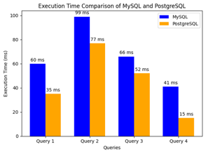

# EcomDB-Benchmarks

**MySQL vs PostgreSQL Performance Benchmark in E-commerce Context**

## 성능 테스트 개요

이 레포지토리는 Mac M3 기반의 로컬 개발 환경에서 MySQL과 PostgreSQL의 성능을 비교하기 위한 벤치마크 실험을 포함합니다. 일반적인 e-commerce 데이터베이스 구조(Users, Orders, Order_Items)를 기반으로 10,000명의 사용자 데이터, 10,000개의 주문 데이터, 100,000개의 주문 항목 데이터를 활용하여 테스트를 수행했습니다.

## 테스트 쿼리 설명

아래와 같은 4개의 주요 쿼리를 통해 데이터베이스의 조회, 삽입, 업데이트 성능을 비교했습니다.

| Query No. | 작업 내용                                       | 특이사항                                   |
|-----------|------------------------------------------------|--------------------------------------------|
| Query 1   | 총 지출이 500 이상인 사용자를 조회하고 지출 내림차순으로 정렬 | 인덱스를 사용한 대량 데이터 조회 및 필터링 쿼리 |
| Query 2   | Orders 테이블에 1,000개의 주문 데이터 삽입 및 Order_Items 테이블에 10,000개의 주문 항목 삽입 | 대량 삽입 및 조회 테스트                   |
| Query 3   | 사용자의 총 지출 금액 및 주문 개수 조회          | 복잡한 다중 테이블 조인                    |
| Query 4   | 사용자의 총 지출이 1,000 이상인 경우 주문 가격을 10% 할인  | 대량 업데이트 (인덱스 사용)                |

## 실험 결과 요약

- **MySQL**: 대규모 웹 애플리케이션에서 기본적인 CRUD 작업에서 빠르고 안정적인 성능을 제공합니다. 특히, 읽기 작업에서 우수한 성능을 보이며 Query 1과 Query 3에서 안정적인 성능을 확인할 수 있었습니다.
- **PostgreSQL**: 고급 쿼리 처리와 대량 데이터 작업에 강점을 보입니다. Query 1과 Query 4에서 MySQL보다 빠른 속도를 기록했으며, 복잡한 트랜잭션 처리에서 높은 신뢰성을 보여줍니다.

## 결론 및 유의사항

- **MySQL**은 사용하기 쉬운 인터페이스와 기본 데이터 작업에 적합한 선택입니다.
- **PostgreSQL**은 복잡한 데이터 처리와 분석 작업에서 더 유리한 성능을 발휘합니다.

> **주의**: 본 테스트는 Mac M3 로컬 환경에서 수행된 결과로, 데이터 양, 쿼리 복잡도, 하드웨어 사양 및 운영 체제에 따라 결과가 달라질 수 있습니다. 실제 운영 환경에서는 다른 결과가 나타날 수 있음을 유의해야 합니다.
